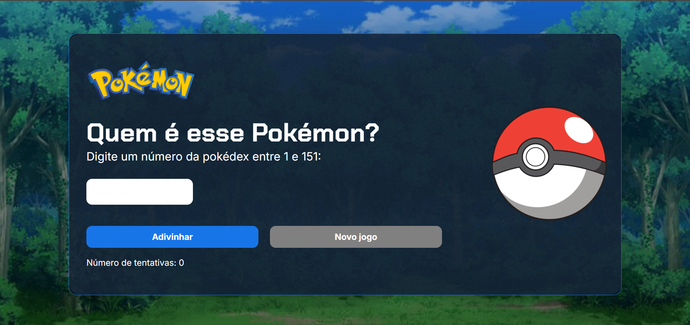
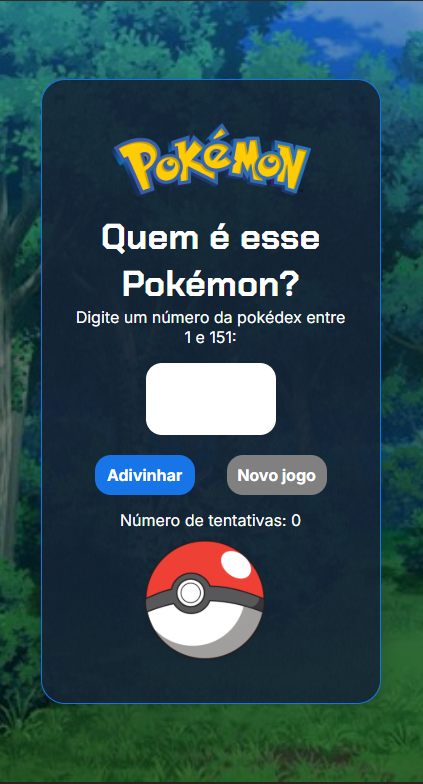

# Jogo do Número Secreto - Edição Pokémon

Um jogo interativo de adivinhação de números desenvolvido com JavaScript, HTML e CSS, personalizado com o tema Pokémon para tornar a experiência mais divertida! 
Projeto desenvolvido como parte do currículo da Alura.

## 🎯 Objetivo

O objetivo é adivinhar o número secreto usando o menor número possível de tentativas, enquanto interage com diferentes Pokémon que aparecem durante o jogo.

## 🎮 Como Jogar

1. Ao iniciar o jogo, um número secreto será gerado automaticamente
2. Digite um número de 1 até 151
3. O jogo irá te dar dicas se o número secreto é maior ou menor
4. Continue tentando até acertar o número secreto!

## 🛠️ Tecnologias Utilizadas

- HTML5
- CSS3
- JavaScript
- Integração com API

## ✨ Funcionalidades

- Integração com PokéAPI para exibição dinâmica de Pokémon
- Feedback visual e sonoro no acerto
- Contagem de tentativas
- Dicas para auxiliar na adivinhação
- Botão de novo jogo para reiniciar a partida
- Interface temática do universo Pokémon

## 🔌 Integrações

- PokéAPI: Utilizada para buscar informações e imagens dos Pokémon

## 📱 Responsividade

O jogo foi desenvolvido com design responsivo, adaptando-se perfeitamente a diferentes dispositivos:
- Smartphones
- Tablets
- Desktops
- Notebooks

## 🌐 Como Acessar

O jogo está disponível em [https://jvprado1.github.io/jogo-numero-secreto/]

---

## 📸 Screenshots

  
  
<i>Tela Desktop do jogo</i>

  
  
<i>Tela Mobile do jogo</i>

  
  
<i>Tela Tablet do jogo</i>

---

Desenvolvido por João Victor Prado durante o curso da Alura.
